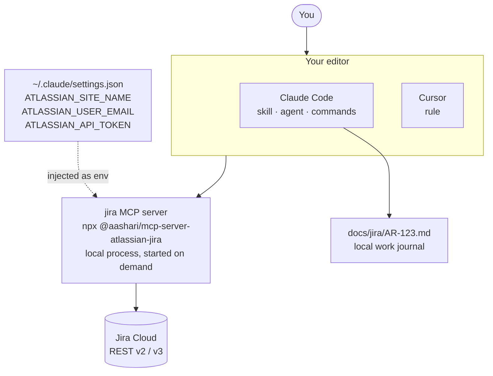
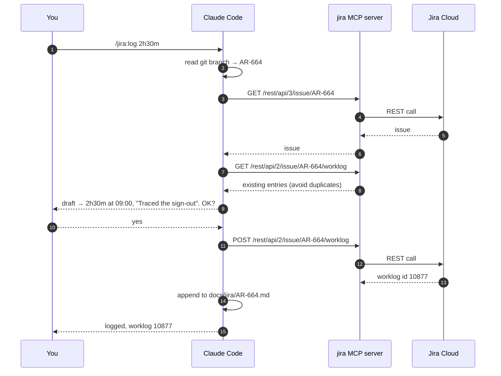

# jira

Jira Cloud issues, comments and worklogs from inside your editor, plus a per-ticket work
journal in `docs/jira/`. Works in **Claude Code** and **Cursor**.

## How it works



Four moving parts, each with one job:

| Part | Job | Claude Code | Cursor |
| --- | --- | :---: | :---: |
| `.mcp.json` | Defines the MCP server and passes it your credentials | yes | via `cursor/install.sh` |
| `skills/jira/` | Teaches the model *how* to drive Jira correctly | yes | as a rule |
| `agents/jira.md` | A `jira` subagent for ticket work in a side thread | yes | no |
| `commands/` | `/jira:log`, `/jira:update`, `/jira:standup` | yes | no |

The MCP server is what actually talks to Jira. Everything else is instruction: which
endpoint to call, when to ask you first, what to write down afterwards.

## Do I need to copy the skill into `.claude/skills/`?

**No.** That is the point of packaging it as a plugin. Once the plugin is installed,
Claude Code loads the skill, the agent and the commands straight out of it. Copying them
into your project would create a second, drifting copy.

You only need the plugin *registered*, which is two keys in a settings file.

## Install for Claude Code

Add to your project's `.claude/settings.json`:

```json
{
  "extraKnownMarketplaces": {
    "areasim": { "source": { "source": "github", "repo": "avishkaG99/jira-plugin" } }
  },
  "enabledPlugins": { "jira@areasim": true }
}
```

Or, if `/plugin` is available in your client:

```bash
/plugin marketplace add avishkaG99/jira-plugin
/plugin install jira@areasim
```

Then add your credentials to `~/.claude/settings.json`, which is personal and outside any
repo:

```json
{
  "env": {
    "ATLASSIAN_SITE_NAME": "your-site",
    "ATLASSIAN_USER_EMAIL": "you@example.com",
    "ATLASSIAN_API_TOKEN": "..."
  }
}
```

`ATLASSIAN_SITE_NAME` is only the subdomain: `acme` for `https://acme.atlassian.net`.
Get a token from [Atlassian account settings](https://id.atlassian.com/manage-profile/security/api-tokens).

Restart, then run `/mcp` to confirm the server connected.

## Install for Cursor

```bash
./harness/cursor/install.sh /path/to/your/project
```

It copies the generated rule to `<project>/.cursor/rules/jira.mdc`, writes the server into
`~/.cursor/mcp.json` with permissions `600`, and reuses your Claude Code credentials if
they are already set so you are not asked twice. Restart Cursor and check
Settings, MCP for a connected `jira` server.

Cursor gets the MCP tools and the conventions. It does not get subagents or slash
commands, which are Claude Code concepts.

## What a request actually does



Note step 9. **Nothing is written to Jira until you approve it.** That rule lives in the
skill, the agent and the Cursor rule, so it holds everywhere.

## The version 2 rule

The single most important convention in this plugin.

Jira's version 3 API demands Atlassian Document Format for any text you send, so a
two-line note becomes a deep JSON tree of paragraph, text and mark nodes. Version 2 takes
the same field as a plain string and converts it server side.

> **When the request body contains text you wrote, use `/rest/api/2/`.
> For everything else, use `/rest/api/3/`.**

```json
POST /rest/api/2/issue/AR-664/worklog
{
  "timeSpent": "2h30m",
  "started": "2026-09-09T09:00:00.000+0530",
  "comment": "Traced the forced sign-out to the session cookie clear."
}
```

`started` is strict: `YYYY-MM-DDTHH:mm:ss.SSS±hhmm`, milliseconds required, no colon in
the offset. `timeSpent` uses Jira units: `2h`, `45m`, `1h30m`, `1d`.

## The work journal

Each ticket gets `docs/jira/<KEY>.md` in your project. It is the working record, richer
than what reaches Jira, and it is what a progress comment gets summarised from.

```markdown
# AR-664 — Accept invite forces a sign-out

Status: In Progress · Branch: fix/ar-664-accept-invite-forced-signout

## Log
### 2026-09-09
- Reproduced on a fresh invite; the session cookie is cleared before the redirect.
- Logged 2h30m (worklog 10877). Comment 10432 posted.

## Decisions
- Keep the redirect, clear the cookie after the token exchange instead.
```

Entries are appended under today's date and never rewritten. Ids returned by the API are
recorded so a later edit targets the right entry instead of adding a duplicate.

## Safety

- Reads run freely. Every write is drafted for you and sent only on your approval.
- No credential is stored in this repo. `.mcp.json` ships `${ATLASSIAN_*}` placeholders
  that resolve from your environment at launch.
- Keep the token in `~/.claude/settings.json`, never in a project settings file, which is
  the one your team shares and the one most likely to be committed.

## How it is built

`core/` holds the knowledge, written once and editor-neutral. `harness/` holds the
per-editor adapters, and most of it is generated:

```bash
scripts/sync.py           # compose core/ into every harness
scripts/sync.py --check   # fail if a harness has drifted
scripts/validate.py       # secrets, manifests, links, frontmatter, sync state
```

To change what the agent knows, edit `core/` and re-run sync. Never hand-edit a file
under `harness/` that carries the generated banner. See [AGENTS.md](AGENTS.md).

## Repo layout

```
jira-plugin/
├── .claude-plugin/marketplace.json   marketplace manifest
├── AGENTS.md                         how to work on this repo
├── core/                             single source of truth, hand-written
│   ├── identity.yaml                 name, description, triggers, the v2 gotcha
│   ├── rules.md                      the five always-apply rules
│   ├── key-resolution.md             branch name to ticket key
│   └── knowledge/
│       ├── reading.md                how to GET
│       ├── writing.md                how to POST/PUT, and the version 2 rule
│       ├── workflows.md              what to do, step by step, per task
│       ├── journal.md                the per-ticket journal format
│       └── conventions.md            areaSim keys, branches, statuses
├── harness/                          per-editor adapters, mostly generated
│   ├── claude/                       Claude Code plugin
│   │   ├── .claude-plugin/plugin.json
│   │   ├── .mcp.json                 MCP server definition
│   │   ├── skills/jira/              composed from core/
│   │   ├── agents/jira.md            the jira subagent
│   │   └── commands/                 /jira:log /jira:update /jira:standup
│   └── cursor/
│       ├── install.sh                wires it into Cursor
│       ├── mcp.json                  standalone server block
│       └── rules/jira.mdc            composed from core/
└── scripts/
    ├── sync.py                       compose core/ into every harness
    └── validate.py                   secrets, manifests, links, sync state
```

## Alternative backend

To use Atlassian's official hosted server instead, which signs in with OAuth and needs no
token, replace `.mcp.json` with:

```json
{ "mcpServers": { "jira": { "type": "sse", "url": "https://mcp.atlassian.com/v1/sse" } } }
```

Check that time tracking is covered before committing to it. Atlassian fixes that tool
set and worklogs may not be included.
